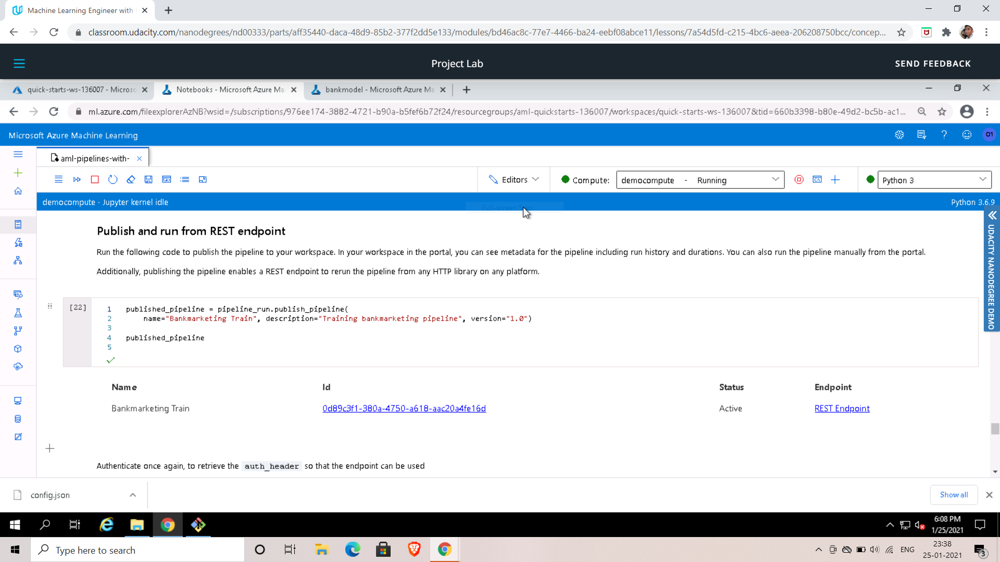
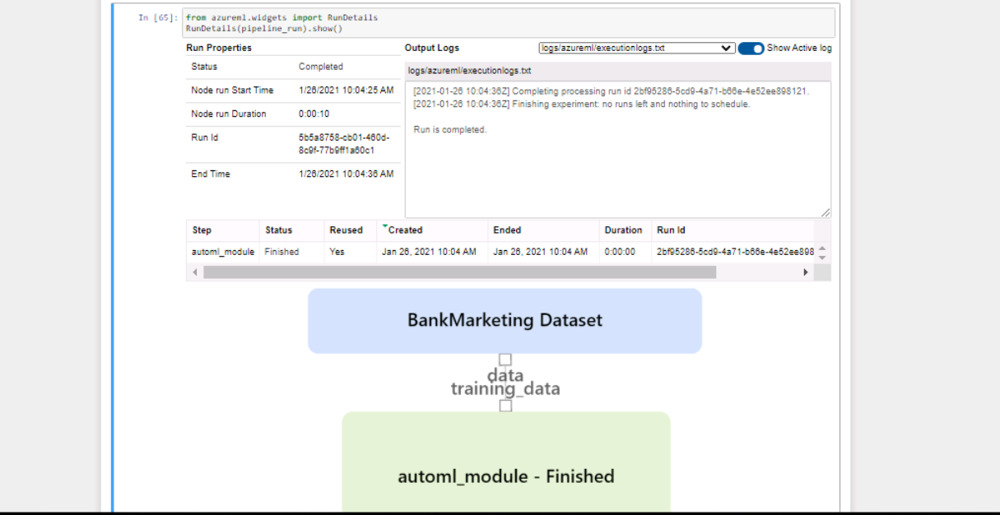
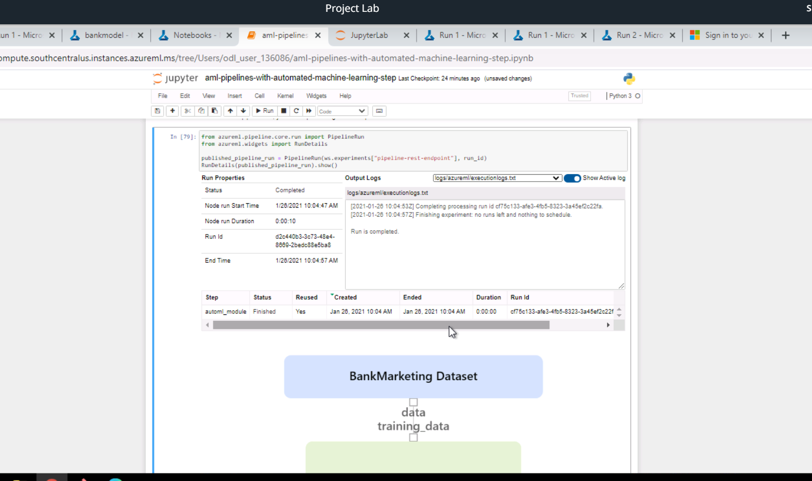

# Operationalizing Machine Learning in Microsoft Azure

The aim of this project is to operationalizing machine learning by creating a model and deploying it, so that we can get an endpoint URL that can easily be accessible by the end-user. In this project, we will be building an end-to-end Machine Learning Model on a dataset (i.e. Bank Marketing Dataset) and will be creating a model, deploying it, and consuming it, also we will be creating, publishing, and consuming a pipeline by creating a pipeline endpoint.

Following step will be followed in the project:

1. Creating Automated ML model
2. Deploy the model
3. Consuming the deployed model (Configuring Swagger documentation)
4. Create Pipeline
5. Consume created Pipeline and Deploy it   

# Dataset
## Data Set Information:

The data is related with direct marketing campaigns of a Portuguese banking institution. The marketing campaigns were based on phone calls. Often, more than one contact to the same client was required, in order to access if the product (bank term deposit) would be ('yes') or not ('no') subscribed.

The classification goal is to predict if the client will subscribe (yes/no) a term deposit (variable y).

### Attribute Information:
#### Input variables:

#### bank client data:
1. age (numeric)
2. job : type of job (categorical: 'admin.','blue-collar','entrepreneur','housemaid','management','retired','self-employed','services','student','technician','unemployed','unknown')
3. marital : marital status (categorical: 'divorced','married','single','unknown'; note: 'divorced' means divorced or widowed)
4. education (categorical: 'basic.4y','basic.6y','basic.9y','high.school','illiterate','professional.course','university.degree','unknown')
5. default: has credit in default? (categorical: 'no','yes','unknown')
6. housing: has housing loan? (categorical: 'no','yes','unknown')
7. loan: has personal loan? (categorical: 'no','yes','unknown')

#### related with the last contact of the current campaign:
8. contact: contact communication type (categorical: 'cellular','telephone')
9. month: last contact month of year (categorical: 'jan', 'feb', 'mar', ..., 'nov', 'dec')
10. day_of_week: last contact day of the week (categorical: 'mon','tue','wed','thu','fri')
11. duration: last contact duration, in seconds (numeric). Important note: this attribute highly affects the output target (e.g., if duration=0 then y='no'). Yet, the duration is not known before a call is performed. Also, after the end of the call y is obviously known. Thus, this input should only be included for benchmark purposes and should be discarded if the intention is to have a realistic predictive model.
    
#### other attributes:
12. campaign: number of contacts performed during this campaign and for this client (numeric, includes last contact)
13. pdays: number of days that passed by after the client was last contacted from a previous campaign (numeric; 999 means client was not previously contacted)
14. previous: number of contacts performed before this campaign and for this client (numeric)
15. poutcome: outcome of the previous marketing campaign (categorical: 'failure','nonexistent','success')
social and economic context attributes
16. emp.var.rate: employment variation rate - quarterly indicator (numeric)
17. cons.price.idx: consumer price index - monthly indicator (numeric)
18. cons.conf.idx: consumer confidence index - monthly indicator (numeric)
19. euribor3m: euribor 3 month rate - daily indicator (numeric)
20. nr.employed: number of employees - quarterly indicator (numeric)
    
#### Output variable (desired target):
21. y - has the client subscribed a term deposit? (binary: 'yes','no')   

# Architectural Diagram
Following is Architecture Diagram of the project which will help have a glance over the steps performed in this project to achieve the desired output:

1. AutoML Run: In this we create a Automated ML model by selecting the Bank Marking dataset from Registered Dataset and create a compute cluster (Standard_DS12_v2) and 1 as maximum number of nodes. We will be run the Automated run as a Classification and setting the Exit Criterion to 1 hour and the Concurrency to 1.
2. Select the Best Model & Deploy: On completion of AutoML run, we will be selecting the best model and we will be deploying it and while deploying we will be using "Azure Container Instances" (ACI) and we will also enable "Authentication".
3. Enabling Application Insights: In order to Enable Application Insights we will be downloading config.json file by going into subscription details and then we need to change the deployed model name in logs.py file and set enable_application_insights to True. And run logs.py file this will enable application insights logs for deployed model.
4. Setup Swagger & interact with it: Then we will be using the swagger documentation endpoint provided in Azure for deployed model and copy content of it and create a swagger.json file and set the swagger documentation for your project by running its bash script and serve.py to serve the content of your projects swagger.json file.
5. Consume Model Endpoint: Next is we will consuming the deployed model we will do this the adding the uri and key in endpoints.py file by copying from deployed model's consume section.
6. Create pipeline via notebook: We will be uploading the notebook provided in the starter files and then modifying at required cells and then will be running the cells which will create the pipeline.
7. Consume created Pipeline: Once the pipeline is created we will runs the cells provided in notebook itself to consume the pipeline.
8. Publish Pipeline: Once pipeline is consumed we will then run the cells provided in notebook to publish the pipeline.   

# Key Steps
## 1. Registered Datasets

From the following list of Registered Dataset we selected the Bank Marketing dataset.  

  

## 2. Create Automated ML Experiment

In this step, we created an Automated ML model using a registered bank marketing dataset, and then created a compute cluster, and started the Automated ML run which created Runs for various models using different algorithms.  

  

And Following are details of Automated ML Run  

  

## 3. Best Run Model

Out of different algorithms tried in the Automated ML run the Best Model was ***Voting Ensemble*** which gave the accuracy of ***91.958%***. Then we deployed this model.  

  

## 4. Enable Application Insights

In order to enable logging downloaded the configuration from Azure workspace and added to project and the made changes in logs.py file to enable application insights.   

  

We enabled Application Insights by making its value *True* in logs.py and ran logs.py file and enabled logging successfully.  

  

## 5. Configuring Swagger Docs

Then we configured swagger docs by installing swagger by changing the port number in bash script file and running it.  

  

Then we started the server by running serve.py file inorder to serve your project's swagger.json file.  

  

## 6. Consuming Endpoints
Then we added endpoint uri and key from deployed model *consume* section, in endpoints.py file and running the file.  

  

  

## 7. Pipeline Created, Deployed and Consumed

For this section we uploaded the sample notebook provided and made required changes in cell and ran the notebook. This created pipeline and then we deployed the pipeline which generated the endpoint for the pipeline which we consumed it.  

  

  

  

  

  

  

# Screen Recording
Following is the url for screen recording: [link](https://shorturl.at/dpyGO)   

# Standout Suggestions
- Resolving data imbalance issue in the dataset can prevent the bais and could improve the model prediction even more.
- Trying out deep learning (neural net) option when training the model, this could improve the accuracy.
- Try setting the featurization parameter of the AutoMLConfig class to 'auto', meaning that the featurization step should be done automatically.
